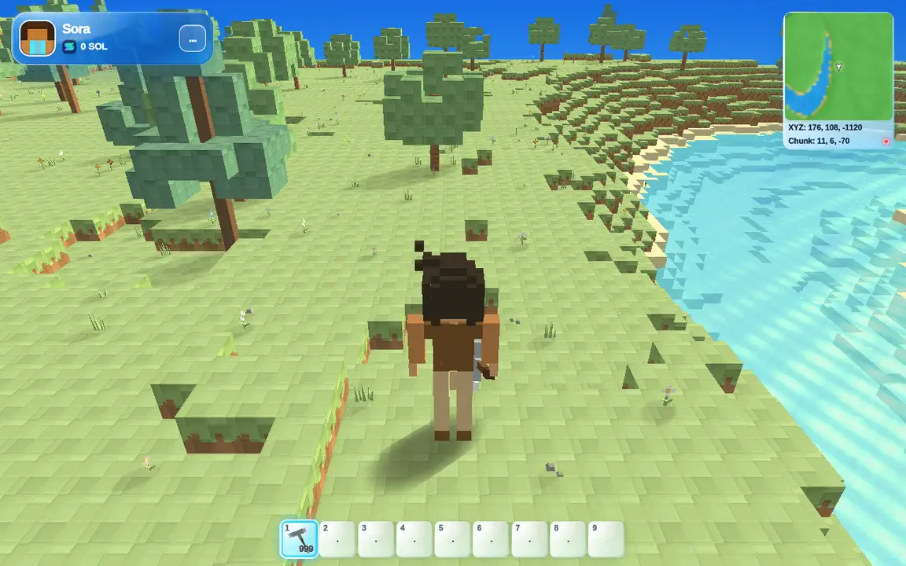

# NICECHUNK Game

[](https://github.com/nicechunk/game/actions/workflows/ci.yml)
[](LICENSE)
[](https://explorer.solana.com/?cluster=devnet)

**A browser-native voxel civilization client built around verifiable Solana state.**

NICECHUNK combines a deterministic voxel world, the custom WebGL2
[Chunk.js](https://github.com/nicechunk/chunk.js) engine, Solana programs, and a
Guardian real-time layer. This repository is the open-source game client: it
renders the world, handles player interaction, constructs transactions, and
reconciles confirmed chain state.

> The public game is an experimental pre-release running on **Solana Devnet**.
> Devnet state can be reset and has no monetary guarantees. Never import a
> mainnet wallet or a private key that protects assets of real value.

[Play NICECHUNK](https://nicechunk.com/play) | [Documentation](https://nicechunk.com/docs/) | [Website](https://nicechunk.com) | [Report an issue](https://github.com/nicechunk/game/issues/new/choose)



_A real in-game capture from the browser client. Terrain, UI, and Devnet state
continue to evolve during the pre-release._

## What Is Here

The Game repository is NICECHUNK's integration surface. It connects four
different responsibilities without pretending that they have the same trust
or persistence model:

| Layer | Role | Authority |
| --- | --- | --- |
| Browser runtime | Rendering, input, prediction, UI, and local caches | Immediate presentation only |
| Guardian | Nearby movement, chat, presence, and regional real-time messages | Low-latency coordination, not Solana finality |
| Solana programs | Persistent players, inventory, skills, world deltas, buildings, and market state | Confirmed PDA state |
| Deterministic reconstruction | World seed, public rules, and confirmed deltas | Reproducible world view |

The distinction matters. Seeing an animation does not prove a transaction was
accepted, and a Guardian message does not replace confirmed chain state. See
[Architecture](docs/architecture.md) for the complete data flow.

## Current Capabilities

- Deterministic terrain generation and chunk reconstruction with Chunk.js.
- Mining, tree extraction, multi-block actions, and terrain-delta rendering.
- Chain-backed inventory mutations and atomic placed-block submissions.
- Backpack presentation stacks up to 99 matching resources while preserving
  the underlying independent chain records.
- Physical material quantities with volume, density, mass, and burden limits.
- Smelting recipes, skill-based output bonuses, forging, equipment, and tools.
- NCM building previews, foundations, construction, and spatial collision.
- Marketplace listings, categories, item presentation, purchase, and cancel
  flows.
- Skill progression for extraction, burden, smelting, forging, exploration,
  movement, and related game systems.
- Guardian-backed multiplayer presence, names, appearance, equipment, and
  chat.
- Desktop and mobile controls, including touch movement and responsive panels.
- Nine maintained locales: English, Spanish, French, German, Japanese,
  Russian, Korean, Traditional Chinese, and Simplified Chinese.

## Project Status

| Item | Current public configuration |
| --- | --- |
| Maturity | Experimental pre-release |
| Solana cluster | Devnet |
| Runtime configuration | `public/mainnet.json` |
| Client runtime version | `0.1.69` |
| Horizontal chunk footprint | `16 x 16` blocks |
| Build range | Y `-32` through `320` |
| Renderer | Chunk.js WebGL2 submodule |
| License | Apache-2.0 |

Runtime schemas, program addresses, and game balance can change before a
mainnet release. Read configuration from the repository instead of hard-coding
the values in this table.

## Quick Start

### Prerequisites

- Git with submodule support.
- Node.js `^20.19.0` or `>=22.12.0`; Node 22 is recommended.
- npm 10 or newer.
- Chromium for the browser integration tests.
- A WebGL2-capable browser for the game preview.

### Install and verify

```bash
git clone --recurse-submodules https://github.com/nicechunk/game.git
cd game
npm ci
npx playwright install chromium
npm run check
npm run build
```

On a new Linux CI machine, install the browser and its system dependencies with
`npx playwright install --with-deps chromium`.

### Preview the production-shaped build

```bash
npm run preview
```

Open `http://127.0.0.1:4173/play/`. The preview command assembles the generated
runtime, chain bundle, and public assets into a disposable `.play-preview/`
directory. Run `npm run build` again after changing source files.

The hosted game also depends on the NICECHUNK website for its login and shared
site routes. A local preview validates the Game repository, but it is not a
replacement for the complete production shell.

## Commands

| Command | Purpose |
| --- | --- |
| `npm run check` | Run repository policy, locale validation, and all tests |
| `npm run check:policy` | Reject credential paths, likely secrets, and misplaced translated text |
| `npm run check:i18n` | Validate all nine locale dictionaries and runtime references |
| `npm test` | Run Node and Playwright game tests against an isolated local server |
| `npm run build:chain` | Bundle the browser-facing Solana integration |
| `npm run build:play` | Produce the versioned Chunk.js game runtime |
| `npm run build` | Build the complete Game deployment artifact |
| `npm run preview` | Serve a local production-shaped build on port 4173 |

More detail is available in [Development](docs/development.md) and
[Testing](docs/testing.md). For startup, wallet, RPC, transaction, Guardian, or
WebGL failures, use [Troubleshooting](docs/troubleshooting.md).

## Repository Layout

| Path | Responsibility |
| --- | --- |
| `play/` | Game UI, controls, runtime orchestration, Guardian integration, and tests |
| `src/chain/` | Transaction construction, PDA reads, submissions, and chain reconciliation |
| `src/data/` | Canonical block, drop, and smelting rule adapters |
| `src/physics/` | Resource mass and physical quantity calculations |
| `src/world/` | World configuration, canonical resources, and block definitions |
| `src/market/` | Marketplace categorization and presentation rules |
| `sdk/` | Client-side Solana account and Guardian helpers |
| `public/` | Runtime configuration, public rules, locales, icons, and character assets |
| `config/` | Source configuration used to produce public runtime rules |
| `scripts/` | Policy checks, test orchestration, builds, preview, and static serving |
| `chunk.js/` | Pinned Chunk.js engine Git submodule |

## Network and Wallet Safety

The browser can use an injected Solana wallet or a NICECHUNK local game wallet.
The local game wallet stores its secret material in browser `localStorage` so
the browser can sign game actions. It is not a hardware wallet and it is not
protected from a same-origin script compromise. Back it up before funding it,
use it only for the Devnet game, and never reuse the key elsewhere.

Optional Helius keys and custom RPC URLs are also browser-local settings. They
must be treated as low-privilege client credentials, not server secrets. Use
provider restrictions where available and rotate a key if it appears in logs,
screenshots, issues, or commits.

Every chain action can consume Devnet SOL for transaction fees or account rent.
The client separates submitted, confirmed, and failed states; users should not
interpret optimistic UI feedback as finality. See [Security Model](docs/security-model.md)
before integrating or operating the client.

## Related Repositories

- [nicechunk/chunk.js](https://github.com/nicechunk/chunk.js): voxel rendering
  engine and engine-level runtime systems.
- [nicechunk/nicechunk-programs](https://github.com/nicechunk/nicechunk-programs):
  Solana programs used by the game.
- [nicechunk/nicechunk-guardian](https://github.com/nicechunk/nicechunk-guardian):
  Guardian regional real-time service.
- [nicechunk/nicechunk-ncm](https://github.com/nicechunk/nicechunk-ncm): NCM
  voxel asset and building format.
- [nicechunk/nicechunk-web](https://github.com/nicechunk/nicechunk-web): public
  website and shared site shell.

Renderer changes belong in Chunk.js and program validation changes belong in
the Programs repository. This repository should update the relevant submodule
or integration after the upstream change is published.

## Contributing

Issues and focused pull requests are welcome. Start with
[CONTRIBUTING.md](CONTRIBUTING.md), follow the [Code of Conduct](CODE_OF_CONDUCT.md),
and report vulnerabilities through the private path in [SECURITY.md](SECURITY.md).

When proposing a behavior change, identify which truth layer owns it and add a
regression test at that boundary. Do not commit wallets, private keys, RPC
credentials, build output, deployment logs, or local agent files.

## License

Licensed under the [Apache License 2.0](LICENSE). See [NOTICE](NOTICE) for
attribution information. Dependencies and the Chunk.js submodule retain their
own license notices.
