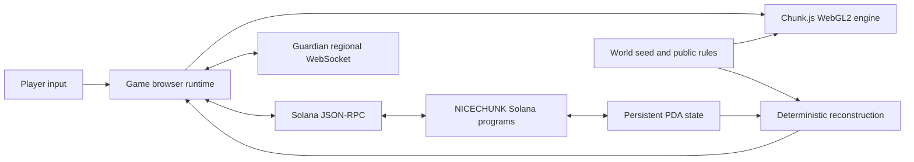

# Architecture

This document explains how the NICECHUNK browser client turns deterministic
world data, real-time messages, and confirmed Solana accounts into one playable
view. It also marks the boundaries that must remain explicit in code and UI.

## System Context

The Game repository owns browser orchestration and chain integration. Chunk.js
owns general engine behavior. NICECHUNK Programs own chain validation and state
transitions. Guardian supplies low-latency regional communication but cannot
finalize a Solana action.

## Four Truth Layers

### 1. Browser presentation

The browser must react immediately to input. It can animate a swing, draw a
placement preview, update a progress indicator, or predict movement before a
network round trip. These effects are presentation state. They are disposable
and must be reconciled after a chain or Guardian response.

Relevant code includes `play/main.js`, UI controllers, input modules, local
caches, and Chunk.js rendering calls.

### 2. Guardian real-time state

Guardian carries nearby movement, heartbeat, chat, appearance, equipment, and
regional discovery messages. This makes multiplayer interaction responsive.
Messages can be delayed, dropped, or superseded, so the client expires stale
presence and exposes connection loss instead of treating silence as chain
state.

Guardian does not sign for a player and does not replace program validation.

### 3. Solana PDA state

NICECHUNK programs validate signed actions and write persistent records such as
players, inventories, skills, terrain deltas, foundations, buildings, and
market listings. The client reads these accounts through RPC and treats a
confirmed account update as the persistent result of an action.

Program IDs and rule-table addresses are runtime configuration. The current
public values live in `public/mainnet.json`, despite the historical filename;
the configured cluster is Devnet.

### 4. Deterministic reconstruction

Most untouched terrain does not need an account for every visible block. The
browser rebuilds the baseline from a versioned seed and public world rules,
then applies confirmed deltas. This makes independently generated views agree
without storing the complete rendered scene on chain.

Visual effects, transient particles, interpolated motion, and UI layout are not
claimed as on-chain state.

## Transaction Lifecycle

1. Input code creates a game intent from the selected target and current UI
   state.
2. The chain adapter reads the accounts and rule data required to build an
   instruction.
3. The injected wallet or local game session signs the transaction permitted by
   that flow.
4. The client simulates or submits the transaction and reports the pending
   state without allowing duplicate actions.
5. Confirmation and account reads determine the persistent outcome.
6. Inventory, terrain, skills, buildings, or market UI reconcile to the
   confirmed state. Failed optimistic effects are removed or refreshed.

An animation at step 1 and a transaction signature at step 4 are not proof of
step 5. Error handling must preserve that distinction.

## Runtime Composition

The production-shaped build is intentionally split:

- `vite.chain.config.js` bundles Solana dependencies and the browser-facing
  chain module into `dist/assets/`.
- `scripts/build-play-debug-runtime.mjs` hashes the game, locale, rule, chain,
  and Chunk.js sources into a versioned runtime under `.play-runtime/`.
- `play/play-loader.js` is a small parser-blocking loader that exposes staged
  loading and failure information before the larger game graph executes.
- `play/play-onboarding-loader.js` defers onboarding code and styles.
- The full website deployment combines the Game artifact with shared login,
  navigation, and public routes.

Generated directories are artifacts, not source. Do not commit `dist/`,
`.play-runtime/`, or `.play-preview/`.

## World and Chunk Model

The current public configuration uses a `16 x 16` horizontal chunk footprint.
Vertical world limits are configured independently (`-32` through `320` in the
current Devnet configuration), so a chunk should not be described as a fixed
`16 x 16 x 256` allocation.

Chunk rendering combines:

- Deterministic baseline terrain.
- Confirmed terrain-delta accounts.
- Confirmed placed-block and building state.
- Surface decoration rules.
- Nearby transient actors and effects.

Chunk caches are wallet- and world-aware where state could otherwise leak
between sessions. Cache invalidation is part of correctness, not only a
performance optimization.

## Inventory and Material Model

The chain stores inventory resources as independent records. The backpack UI
groups compatible records into display stacks of at most 99 items. Capacity
and action construction must use the canonical underlying records, not infer
chain occupancy from the number of rendered cards.

Resource physics uses canonical quantity, volume, density, and mass adapters.
Smelting and forging must derive output physics from accepted recipes and skill
effects rather than copying input presentation values.

## Repository Boundaries

| Change | Primary repository |
| --- | --- |
| Game UI, chain adapter, inventory presentation, input | `nicechunk/game` |
| Generic rendering, meshing, water, camera engine behavior | `nicechunk/chunk.js` |
| Instruction validation, PDA layout, authoritative state transition | `nicechunk/nicechunk-programs` |
| Guardian protocol and regional service | `nicechunk/nicechunk-guardian` |
| NCM format and codec | `nicechunk/nicechunk-ncm` |
| Shared site shell, login pages, and public navigation | `nicechunk/nicechunk-web` |

Cross-repository changes should land in the owning repository first. The Game
repository then updates its submodule, adapter, configuration, and tests in one
reviewable change.

## Design Invariants

- Never present an optimistic effect as a confirmed chain result.
- Never let Guardian messages authorize a persistent state transition.
- Never derive transaction identity from translated display text or icons.
- Keep canonical item, recipe, and block identifiers stable across UI layers.
- Scope persistent browser caches to the relevant wallet, world, and schema.
- Treat local wallet material and RPC credentials as secrets even on Devnet.
- A chain-facing behavior change requires a test for instruction bytes,
  accounts, reconciliation, or all three.
